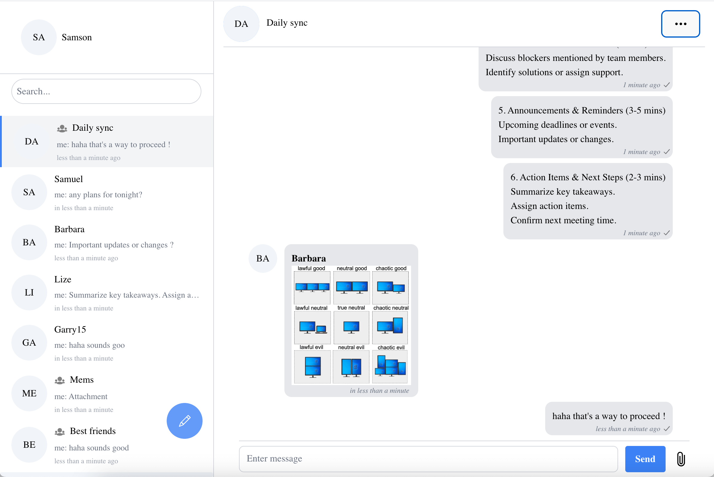

# Chat code sample for React for ConnectyCube

This README introduces [ConnectyCube](https://connectycube.com/) Chat code sample for Web  

Project contains the following features implemented:

- User Login / SignUp / Logout
- Chat dialogs creation
- 1-1 messaging
- Group messaging
- Users search
- Typing status
- Sent / Read statuses (read messages in users view)
- Last seen
- User / Group profile

# Documentation

ConnectyCube JS SDK getting started - [https://developers.connectycube.com/js](https://developers.connectycube.com/js)

ConnectyCube Messaging API documentation - [https://developers.connectycube.com/js/messaging](https://developers.connectycube.com/js/messaging)

# Screenshots

# Build your own Chat app

To make the sample works for your own app, please do the following:

1.  Register new account at `https://connectycube.com/signup/`. Then go to Admin panel, create Application and  put Application credentials from 'Overview' page into `src/config.ts` file
2. Run  `npm install` to install node modules;
3. Run `npm run dev` and open http://localhost:5173

# Can't build yourself?

Got troubles with building code sample? Create an issue at [Issues page](https://github.com/ConnectyCube/connectycube-web-samples/issues)