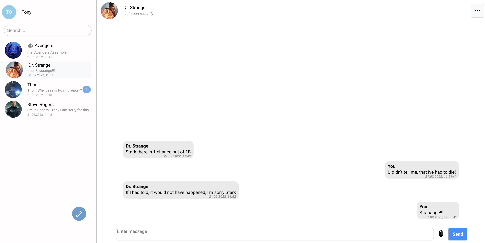

# **Chat code sample for ReactJS for ConnectyCube platform**

### This README introduces [ConnectyCube](https://connectycube.com/) Chat code sample for Web  

### Project contains the following features implemented:

- User Login / SignUp / Logout
- Chat dialogs creation
- 1-1 messaging
- Group messaging
- Users search
- Typing status
- Sent / Read statuses (read messages in users view)
- Last seen
- User / Group profile

# **Documentation**

ConnectyCube JS SDK getting started - https://developers.connectycube.com/js

ConnectyCube Messaging API documentation - https://developers.connectycube.com/js/messaging

# **Screenshots**

# **Build your own Chat app**

### To make the sample works for your own app, please do the following:

1. Register new account at https://connectycube.com/signup/. Then go to Admin panel, create Application and check Application credentials from 'Overview'
2. Create an .env file and copy information from .env.example, then replace APP_ID, SERCRET_KEY and AUTH_KEY
3. Install node modules - npm install
4. Run npm run start and open https://localhost:3000 or http://localhost:3000

# **Can't build yourself?**

Got troubles with building code sample? Create an issue at [Issues page](https://github.com/ConnectyCube/connectycube-web-samples/issues)
